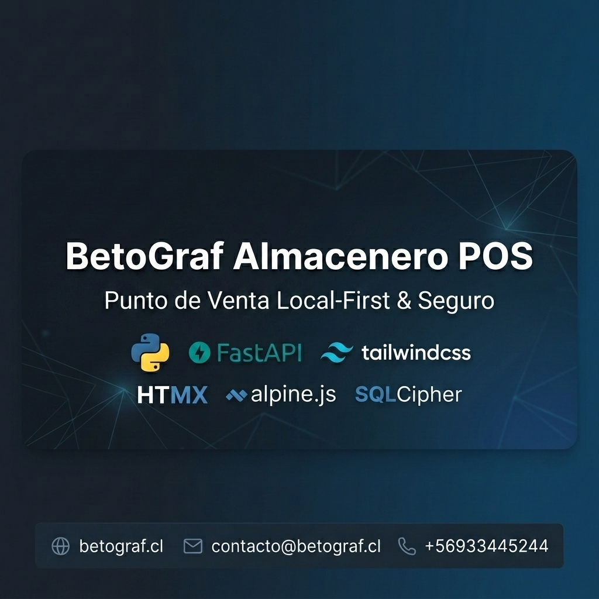

  

   
   

  # BetoGraf Almacenero 1.5 Release

  **Una experiencia POS moderna, profesional y pensada para comercios reales.**

  

    
    
    
    
  

  

    <b>No es solo un sistema para cobrar.</b> 
    Es una herramienta para vender con mas orden, controlar mejor tu negocio y dar una imagen mas seria frente a tus clientes.
  

  

    <a href="https://betograf.cl"><b>Solicitar informacion comercial</b></a>
    &nbsp;|&nbsp;
    <a href="https://wa.me/56933445244"><b>Hablar por WhatsApp</b></a>
  

---

## La pregunta mas importante

### Esta app es la que necesito para mi negocio?

**Si**, si tu negocio necesita una solucion que te ayude a:

- vender rapido en mostrador
- reducir desorden operativo
- controlar caja, ventas e inventario desde un solo lugar
- trabajar con una interfaz moderna y clara
- profesionalizar la atencion sin complicar al personal

**BetoGraf Almacenero** fue pensado para negocios que viven el ritmo real del comercio:

- almacenes de barrio
- minimarkets
- botillerias
- kioscos
- tiendas de conveniencia
- locales con uno o varios cajeros

---

## Lo que cambia cuando lo implementas

<table>
  <tr>
    <td width="33%">
      <h3>Mas velocidad</h3>
      
La venta se siente directa, limpia y comoda. Menos pasos, menos friccion y mejor ritmo de atencion en horas punta.

    </td>
    <td width="33%">
      <h3>Mas control</h3>
      
Productos, clientes, caja, reportes y administracion quedan integrados en una sola operacion visualmente clara.

    </td>
    <td width="33%">
      <h3>Mas imagen</h3>
      
Tu negocio se ve mas serio, mas ordenado y mas preparado para crecer frente a clientes, equipo y socios.

    </td>
  </tr>
</table>

---

## Hecha para vender mejor

### Terminal de Ventas

- flujo de venta agil y visual
- metodos de pago claros
- calculo de vuelto
- descuento aplicado visible
- documento de salida integrado
- operacion comoda en pantallas pequenas y grandes

### Carrito y Cobro

- total a pagar con alta visibilidad
- resumen comercial claro
- cobro mas compacto y ordenado
- venta a credito dentro del flujo

### Admin y Reportes

- panel de control mas limpio y util
- control de productos, categorias, clientes y usuarios
- reportes contables y de ventas
- informacion mas facil de leer y usar

### Caja y Operacion

- apertura y cierre de turno
- mejor orden de movimientos
- apoyo operativo para supervisar caja

---

## La experiencia que transmite

No queriamos una app que solo "funcione".
Queriamos una app que, al verla abierta en el negocio, comunique de inmediato:

- orden
- rapidez
- profesionalismo
- control
- confianza

Ese es uno de los grandes valores de esta release 1.5.

---

## Seguridad y confianza sin tecnicismos innecesarios

El cliente no necesita saber toda la ingenieria interna.
Lo importante es esto:

- la operacion fue pensada con enfoque local-first
- existe control de acceso y de licencia
- la version full opera con activacion por serial
- la distribucion fue preparada con criterio comercial serio
- el sistema fue trabajado para una operacion estable y profesional

En simple: **no es una app improvisada**.

---

## Versiones comerciales

<table>
  <tr>
    <th>Version</th>
    <th>Ideal para</th>
    <th>Que ofrece</th>
  </tr>
  <tr>
    <td><b>Demo</b></td>
    <td>Conocer el producto</td>
    <td>Experiencia limitada por capacidad y tiempo para evaluar la propuesta.</td>
  </tr>
  <tr>
    <td><b>Trial</b></td>
    <td>Probar el flujo real</td>
    <td>Permite validar la experiencia de trabajo antes de pasar a una licencia comercial.</td>
  </tr>
  <tr>
    <td><b>Full</b></td>
    <td>Operacion profesional</td>
    <td>Acceso completo para uso productivo con activacion por licencia.</td>
  </tr>
</table>

---

## Por que puede ser una buena inversion

Porque una buena app POS no solo cobra.
Tambien te ayuda a:

- ahorrar tiempo
- disminuir errores
- ordenar mejor la operacion
- ver tu negocio con mas claridad
- proyectar una imagen mucho mas profesional

Cuando un sistema te permite trabajar con mas seguridad y mas control, deja de ser un gasto y se vuelve una herramienta comercial.

---

## Lo que incluye esta 1.5 Release

- experiencia visual mucho mas refinada
- mejoras amplias de responsividad en toda la app
- modulo de ventas mucho mas solido
- admin mas compacto y mejor aprovechado
- caja y rrhh mejor alineados
- base comercial con Demo, Trial y Full
- infraestructura de licenciamiento lista para distribucion

---

## Si hoy quieres profesionalizar tu negocio

**BetoGraf Almacenero 1.5 Release** esta pensado para eso.

No para verse complejo.
No para llenarte de pasos innecesarios.
No para ser otra herramienta mas que termina abandonada.

Sino para ayudarte a vender, controlar y crecer con una base mucho mas seria.

---

## Contacto comercial

| Canal | Contacto |
| --- | --- |
| Web | [betograf.cl](https://betograf.cl) |
| WhatsApp | [+56 9 3344 5244](https://wa.me/56933445244) |
| Producto | BetoGraf Almacenero 1.5 Release |

---

## Cierre

Si buscas una app generica, hay muchas opciones.
Si buscas una solucion que se sienta seria, moderna, comercial y pensada para el ritmo real de un negocio de barrio, **BetoGraf Almacenero puede ser exactamente la decision correcta**.
