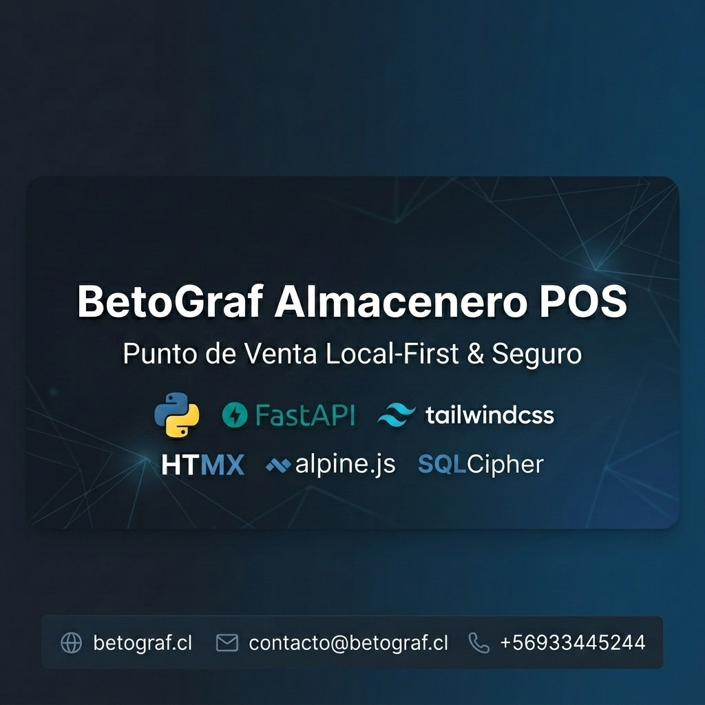

# BetoGraf Almacenero POS - Versión 2.3.9.2

  

   
  
  ### **El Punto de Venta (POS) Profesional, Blindado y Offline-First para Comercios Exigentes**
  
  *Una solución local de alto rendimiento diseñada bajo estándares de ingeniería de software para maximizar la velocidad de cobro, resguardar tus datos y mantener tu negocio siempre activo.*

  

    
    
    
    
  

  

    <b>¿Cansado de los sistemas lentos basados en la nube?</b> 
    BetoGraf Almacenero opera directamente en tu equipo físico. Tus datos se quedan en tu máquina, cifrados bajo estándares de grado bancario y militar (AES-256), con contraseñas blindadas según norma NIST SP 800-63B, y el sistema responde de forma instantánea sin requerir conexión a internet.
  

  

    👉 <b><a href="./CERTIFICACION_Y_CALIDAD.md">Lee aquí el Dictamen de Certificación Comercial, Rendimiento y Seguridad v2.3.9.2</a></b>
  

---

## Descarga Rápida de Instaladores Oficiales (v2.3.9.2)

A continuación, selecciona tu plataforma para descargar el instalador oficial optimizado:

  <table style="width: 90%; border-collapse: collapse; border: 1px solid #e2e8f0;">
    <thead>
      <tr style="background-color: #f8fafc;">
        <th align="center" style="padding: 12px; border: 1px solid #e2e8f0; width: 50%;">🪟 Versión para Windows</th>
        <th align="center" style="padding: 12px; border: 1px solid #e2e8f0; width: 50%;">🐧 Versión para Linux</th>
      </tr>
    </thead>
    <tbody>
      <tr>
        <td align="center" style="padding: 20px; border: 1px solid #e2e8f0; vertical-align: top;">
          
            
          <b>BetoGraf_Almacen_Setup_v2.3.9.2.exe</b> 
          <small style="color: #64748b;">Instalador autogestionado para Windows 10 y 11 (64-bits)</small> 
          Tamaño: ~54.2 MB (Optimizado)
        </td>
        <td align="center" style="padding: 20px; border: 1px solid #e2e8f0; vertical-align: top;">
          
            
          <b>Linux: distribución bajo pedido corporativo</b> 
          <small style="color: #64748b;">El release oficial actual utiliza el instalador Windows binario ultra-optimizado con Cython + PyInstaller + Inno Setup</small> 
          Arquitectura C Nativa
        </td>
      </tr>
    </tbody>
  </table>

---

## 💼 Matriz de Licenciamiento y Módulos

BetoGraf Almacenero cuenta con un esquema de licenciamiento escalable según tus necesidades operativas:

| Módulo Operativo | 🧪 Demo | ⏳ Trial (20 Días) | 💎 Comercial (Full) |
| :--- | :---: | :---: | :---: |
| **Punto de Venta (Caja y Ventas)** | Limitado (5 productos) | ✅ Completo | ✅ Ilimitado |
| **Control de Turnos y Efectivo** | ✅ Básico | ✅ Completo | ✅ Completo |
| **Gestión de Inventario FIFO** | ❌ Inactivo | ✅ Completo | ✅ Completo |
| **Reportes Financieros Avanzados** | ❌ Inactivo | ✅ Completo | ✅ Completo |
| **Omnicanalidad y E-Commerce** | ❌ Inactivo | ✅ Completo | ✅ Completo |
| **Integración SII (DTE)** | ❌ Inactivo | ❌ Inactivo | ✅ Completo |
| **Sincronización Cloud (Respaldos)** | ❌ Inactivo | ✅ Opcional | ✅ Integrado |
| **Soporte Prioritario y OTA Updates** | ❌ Inactivo | ❌ Inactivo | ✅ Permanente |

---

## 🛠️ Especificaciones Técnicas (Ficha de Ingeniería)

El núcleo del sistema ha sido rediseñado y blindado en la versión **2.3.9.2** para asegurar una estabilidad del 99.9% frente a cortes eléctricos o de red e integrar soluciones de grado industrial:

*   **Arquitectura de Backend**: Django 5.x integrado con **Waitress WSGI**, garantizando una API local robusta, de alta concurrencia y sin fugas de memoria.
*   **Blindaje Binario C (Cython)**: 24 módulos centrales compilados en extensiones C nativas (`.pyd`) mediante MSVC, protegiendo la lógica de negocio contra descompilación o ingeniería inversa.
*   **Criptografía y Autenticación NIST SP 800-63B**: Hashing de contraseñas reforzado con PBKDF2-SHA256 a **100.000 iteraciones** y limitador de tasa contra ataques de fuerza bruta en login.
*   **Seguridad de Datos**: Base de datos SQLite cifrada nativamente con **SQLCipher** (cifrado AES-256). Tus ventas, costos y clientes están blindados ante accesos físicos no autorizados.
*   **Carga 100% Offline (Local-First)**: Toda la interfaz gráfica, plantillas e interactividad (Tailwind CSS, Alpine.js y HTMX) se encuentran integrados localmente en los assets. **Funciona a la perfección sin conexión a internet**.
*   **Gestión de Inventario FIFO**: Trazabilidad contable en tiempo real bajo la regla First-In, First-Out, calculando de forma exacta la utilidad neta de tu negocio.
*   **Omnicanalidad y E-Commerce**: Integración con Shopify, WooCommerce y gestión centralizada de mensajes y pedidos (Instagram/WhatsApp) directo desde el POS.
*   **Despachos B2B y Facturación**: Emisión de Guías de Despacho profesionales y facturación electrónica nativa conectada a los servicios del SII (Ley N° 20.956 y formato DTE).

---

## 🚀 Guías de Instalación Paso a Paso

### 🪟 Instalación en Windows (10 / 11)

1. Descarga el archivo de instalación [BetoGraf_Almacen_Setup_v2.3.9.2.exe](https://github.com/betorockers/BetoGraf_Almacenero/releases/download/v2.3.9.2/BetoGraf_Almacen_Setup_v2.3.9.2.exe).
2. Haz doble clic sobre el ejecutable descargado (`~54.2 MB`).
3. Sigue las instrucciones del asistente en pantalla (se encargará de crear los accesos directos en el escritorio y configurar el Firewall).
4. Abre **BetoGraf Almacen** desde tu escritorio.

> [!TIP]
> Si Windows Defender te muestra una advertencia de SmartScreen (debido a que es un ejecutable nuevo compilado a medida), haz clic en **"Más información"** y luego en **"Ejecutar de todas formas"**. El instalador incluye un certificado local seguro.

---

### 🐧 Despliegue en Linux y Servidores

1. En este release **v2.3.9.2**, la distribución oficial está empaquetada como binario nativo optimizado para Windows 10 y 11 (64-bits).
2. Para despliegues en servidores Linux locales o contenedores Docker empresariales, contáctanos a través de nuestros canales comerciales oficiales.

---

## ❓ Preguntas Frecuentes (FAQ)

#### ¿Mis datos se suben a algún servidor?
No de forma obligatoria. Toda la información de tus productos, ventas y cuadratura de caja se guarda localmente en tu equipo. Si cuentas con el módulo comercial activo, puedes habilitar respaldos en la nube en tiempo real.

#### ¿Cómo adquiero una clave de licencia comercial?
Puedes solicitar una licencia o agendar una demostración comercial personalizada a través de nuestros canales directos.

#### ¿El sistema es compatible con lectores de código de barras?
Sí, es compatible con cualquier lector de código de barras USB o inalámbrico que funcione en modo emulación de teclado (la gran mayoría del mercado).

---

## 📞 Soporte y Canales Directos

  <table style="width: 80%; border-collapse: collapse;">
    <tr style="background-color: #f8fafc;">
      <td align="center" style="padding: 15px; border: 1px solid #e2e8f0; width: 50%;">
        🌐 <b>Sitio Web Oficial</b> 
        <a href="https://betograf.cl">betograf.cl</a>
      </td>
      <td align="center" style="padding: 15px; border: 1px solid #e2e8f0; width: 50%;">
        💬 <b>Contacto por WhatsApp</b> 
        <a href="https://wa.me/56933445244">+56 9 3344 5244</a>
      </td>
    </tr>
  </table>

   
  BetoGraf Almacenero POS es un producto de BetoGraf. Todos los derechos reservados.

